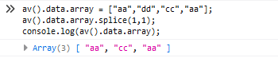
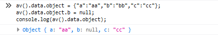

[TOC]
## 注意事项，禁用delete操作符
操作数据的时候，该数据有可能是一个数组或者是一个对象。而删除数组某一个单元、删除对象中某一个键值，勿使用`delete`操作符，不然数据删除变动不会被捕获。那么如何实现删除呢？请使用下面方式：
### 1）数组删除单元，用splice删除数组的元素：
```
av().data.array = ["aa","dd","cc","aa"];
av().data.array.splice(1,1);//删除下标为1的单元
```


### 2）删除对象中某一个键值
```
av().data.object = {"a":"aa","b":"bb","c":"cc"};
av().data.object.b = null;//直接置为空 或者 undefined
```


