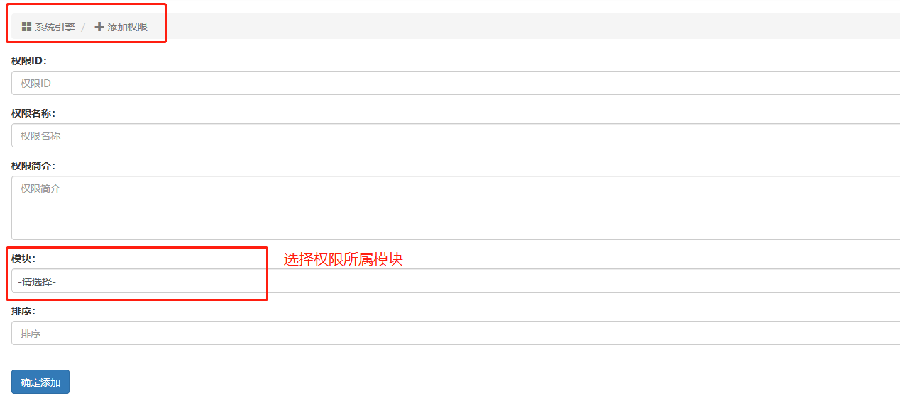

后台就是一些增删改查的接口，常见的接口就应该按照规范来进行开发，下面是示例一些开发套路的代码。

### 权限创建流程
每个项目会使用多个模块，如用户系统、代理系统等等，而后台的权限都放在了对应模块入口文件中。如用户系统，那么就在`/request/user.php`文件中，如下权限设置：
```
<?php
namespace eapie\source\request;
use eapie\main;
use eapie\error;
class user extends main {
    //权限码
    const AUTHORITY_USER_ADD = "user_add";//添加用户权限
    const AUTHORITY_USER_READ = "user_read";//读取用户权限
    const AUTHORITY_USER_EDIT = "user_edit";//编辑用户权限
}
```
在对应的接口代码中，使用该权限的方式：
```
//检查读取用户权限
object(parent::REQUEST_ADMIN)->check(parent::AUTHORITY_USER_READ);
//如果权限不足，会直接返回错误信息给接口，不会再往下执行
```
在检查权限并且权限不足的时候，不主动返回，而是获取错误信息，用下面的方式可以实现：
```
//判断是不是 商品管理员资格权限，如果不是就只能管理自己上传的商品
if( !object(parent::REQUEST_ADMIN)->check(parent::AUTHORITY_GOODS_ADMINISTRATOR, true) ){
    $config["where"][] = array('[and] sg.user_id=[+]', $_SESSION['user_id']);
}
//object(parent::REQUEST_ADMIN)->check()第二个参数是一个布尔值，为真，表示返回一个检查后的布尔值
```
#### 后台添加权限：

权限添加之后，还要通知应用管理，让应用项目绑定该权限，然后到这个应用项目的角色管理中才能勾选这个权限。

### 添加数据接口
命名规范：api_add 或 version_add
示例接口，添加商品：
```
	/**
	 * 添加商品
	 * 
	 * @param	array	$input
	 * @return 	bool
	 */
	public function api_add($input = array()){
	    //第一步，先检查权限
	    object(parent::REQUEST_ADMIN)->check(parent::AUTHORITY_GOODS_ADD);
	    //第二步，数据检测
	    object(parent::ERROR)->check($input, 'shop_goods_name', parent::TABLE_SHOP_GOODS, array('args', 'length'));
	    //第三步，白名单过滤
	    $whitelist = array(
		'shop_goods_name', 
		);
	    $insert_data = cmd(array($input, $whitelist), 'arr whitelist');
	    
	    //第四步，其他数据收集操作
	    //获取id号
	    $insert_data['shop_goods_id'] = object(parent::TABLE_SHOP_GOODS)->get_unique_id();
	    //创建时间
	    $insert_data['shop_goods_insert_time'] = time();
	    //更新时间
	    $insert_data['shop_goods_update_time'] = time();
	
	    ///第五步，插入到数据库
	    if( object(parent::TABLE_SHOP_GOODS)->insert($insert_data) ){
	        //成功后的其他操作
	        //......
	        //插入操作日志
			object(parent::TABLE_ADMIN_LOG)->insert($input, $insert_data);
	        return $insert_data['shop_goods_id'];
	        }else{
	            throw new error("操作失败");
	        }
	}
```


### 列表数据接口
命名规范：api_list 或 version_list
示例接口，商品列表：
```
	
	/**
	 * 获取数据列表
	 * 
	 * @param	array	$input
	 * @return	array
	 */
	public function api_list($input = array()){
		//第一步，先检查权限
		object(parent::REQUEST_ADMIN)->check(parent::AUTHORITY_GOODS_READ);
		//第二步，初始化条件、排序、分页,获得配置信息变量
		$config = array(
			'orderby' => array(),
			'where' => array(),
			'limit' => object(parent::REQUEST)->limit($input, parent::REQUEST_ADMIN),
		);
		//第三步，获取自定义排序
		$config["orderby"] = object(parent::REQUEST)->orderby($input, array(
			//'排序标签，由前端传入进来' => 'orderby() 排序规则值'
			'name_desc' => array('shop_goods_name', true),
			'name_asc' => array('shop_goods_name', false),
			'state_desc' => array('shop_goods_state', true),
			'state_asc' => array('shop_goods_state', false),
			'insert_time_desc' => array('shop_goods_insert_time', true),
			'insert_time_asc' => array('shop_goods_insert_time', false),
			'update_time_desc' => array('shop_goods_update_time', true),
			'update_time_asc' => array('shop_goods_update_time', false),
			'sort_desc' => array('shop_goods_sort', true),
			'sort_asc' => array('shop_goods_sort', false),
			//...
		));
		//避免排序重复，一定要给一个主键排序
		$config["orderby"][] = array('shop_goods_id', false);
		
		//第四步，获取筛选条件
		$config["where"][] = array('[and] sg.shop_goods_trash=0');
		
		//判断是不是 商品管理员资格权限，如果不是就只能管理自己上传的商品
		if( !object(parent::REQUEST_ADMIN)->check(parent::AUTHORITY_GOODS_ADMINISTRATOR, true) ){
			$config["where"][] = array('[and] sg.user_id=[+]', $_SESSION['user_id']);
		}
		
		if( !empty($input['search']) ){
			//示例，筛选商品ID
			if( isset($input['search']['shop_goods_id']) && is_string($input['search']['shop_goods_id']) ){
				$config["where"][] = array('[and] sg.shop_goods_id=[+]', $input['search']['shop_goods_id']);
			}
			//示例，筛选商品状态
			if( isset($input['search']['state']) && 
			(is_string($input['search']['state']) || is_numeric($input['search']['state'])) &&
			in_array($input['search']['state'], array("0", "1", "2", "3")) ){
				$config["where"][] = array('[and] sg.shop_goods_state=[+]', $input['search']['state']);
				}
			//......
		}
		
		//第五步，传入配置信息变量，获取分页列表数据
		$data = object(parent::TABLE_SHOP_GOODS)->select_page($config);
		//第七步，其他操作
		if( !empty($data['data']) ){
			//数据不为空，这里其他操作
		}
		
		//返回数据，无论有没有数据
		return $data;
	}
	
```

### 编辑数据接口
命名规范：api_edit 或 version_edit
示例接口，商品编辑：
```
	
	/**
	 * 编辑商品
	 * 
	 * @param	array	$input
	 * @return 	bool
	 */
	public function api_edit($input = array()){
		//第一步，先检查权限
		object(parent::REQUEST_ADMIN)->check(parent::AUTHORITY_GOODS_EDIT);
		//第二步，数据检测
		object(parent::ERROR)->check($input, 'shop_goods_id', parent::TABLE_SHOP_GOODS, array('args'));
		//因为是编辑数据，所以在存在的情况下才检测
		if( isset($data['shop_goods_sn']) )
		object(parent::ERROR)->check($input, 'shop_goods_sn', parent::TABLE_SHOP_GOODS, array('args', 'length'));
		if( isset($data['shop_goods_name']) )
		object(parent::ERROR)->check($input, 'shop_goods_name', parent::TABLE_SHOP_GOODS, array('args', 'length'));
		//......
		
		//第三步，获取旧数据
		$shop_goods_data = object(parent::TABLE_SHOP_GOODS)->find($input['shop_goods_id']);
		if( empty($shop_goods_data) ){
			throw new error("ID有误，数据不存在");
		}
		//其他操作，判断是不是 商品管理员资格权限，如果不是就只能管理自己上传的商品
		if( !object(parent::REQUEST_ADMIN)->check(parent::AUTHORITY_GOODS_ADMINISTRATOR, true) ){
			if( $shop_goods_data['user_id'] != $_SESSION['user_id'] ){
				throw new error("权限不足，不能操作非自己添加的数据");
			}
		}
		
		//第四步，白名单，只获取能修改的字段数据
		$whitelist = array(
			'shop_goods_parent_id', 
			'shop_goods_name', 
			'shop_goods_sn',
			//......
			);
		$update_data = cmd(array($input, $whitelist), 'arr whitelist');
		//第五步，与旧数据匹配，没有更新的数据删除
		foreach($update_data as $key => $value){
			if( isset($shop_goods_data[$key]) ){
				if($shop_goods_data[$key] == $value){
					unset($update_data[$key]);
				}
			}
		}
		
		//其他操作，判断父级
		if( !empty($update_data["shop_goods_parent_id"]) ){
			object(parent::ERROR)->check($input, 'shop_goods_parent_id', parent::TABLE_SHOP_GOODS, array('args', 'exists_id'));
			if($update_data["shop_goods_parent_id"] == $input["shop_goods_id"]){
				throw new error("父级关联不能设为自己");
			}
		}
		//没有更新则直接抛出错误
		if( empty($update_data) ){
			throw new error("没有需要更新的数据");
		}
		
		//第六步，更新
		$update_data['shop_goods_update_time'] = time();//更新时间
		if( object(parent::TABLE_SHOP_GOODS)->update( array(array('shop_goods_id=[+]', $input['shop_goods_id'])), $update_data) ){
			//成功后的其他操作
			
			//插入操作日志
			object(parent::TABLE_ADMIN_LOG)->insert($input, $update_data);
			
			return $data['shop_goods_id'];
		}else{
			throw new error("操作失败");
		}
		
	}
```

### 删除数据接口
命名规范：api_remove 或 version_remove
示例接口，删除分类：
```
	/**
	 * 删除分类
	 * 
	 * @param	array	$input
	 * @return	string
	 */
	public function api_remove( $input = array() ){
		//第一步，先检查权限
		object(parent::REQUEST_ADMIN)->check(parent::AUTHORITY_TYPE_REMOVE);
        //第二步，校验数据
        object(parent::ERROR)->check($input, 'type_id', parent::TABLE_TYPE, array('args'));
        //第三步，查询旧数据
        $original = object(parent::TABLE_TYPE)->find($input['type_id']);
        if (empty($original)) throw new error('数据不存在');
		
		//其他判断，存在下级则无法删除
		if( object(parent::TABLE_TYPE)->find_exists_son_id($input['type_id']) ){
			throw new error("该分类下存在子级，请先清理子级才能删除该分类");
			}
		
        //第四步，删除数据
        if ( object(parent::TABLE_TYPE)->remove($original['type_id']) ) {
        	//成功后的其他操作
        	
            //其他操作
            
            //插入日志
            object(parent::TABLE_ADMIN_LOG)->insert($input, $original);
            return $input['type_id'];
        } else {
            throw new error('删除失败');
        }
		
	}
```

### 获取单条数据接口

命名规范：api_get 或 version_get
示例接口，获取一个管理角色：
```
	/**
	 * 获取一条数据
	 * 
	 * @param	array	$input
	 * @return	array
	 */
	public function api_get( $input = array() ){
		//第一步，检查权限
		object(parent::REQUEST_ADMIN)->check(parent::AUTHORITY_ADMIN_READ);
		//第二步，效验参数
		object(parent::ERROR)->check($input, 'admin_id', parent::TABLE_ADMIN, array('args'));
		
		//第三步，获取数据
		$get_data = object(parent::TABLE_ADMIN)->find($input['admin_id']);

		//判断数据
		if( empty($get_data) ){
			throw new error("角色不存在");
		}
		
		//返回数据
		return $get_data;
	}
	
```


### 查询并获取单条简单的数据接口
api_query

### 获取选项列表接口
命名规范：api_option 或 version_option
示例接口，获取分类选项：
	/**
     * 查询分类选项
     *
	 * @param	array	$input
     * @return array
     */
    public function api_option($input = array()){
        //一样的，先检测输入
        object(parent::ERROR)->check($input, 'module', parent::TABLE_TYPE, array('args'), 'type_module');

		//给出默认值，注意。这里是不需要分页的。直接查询全部作为选项
        $config = array(
            'orderby' => array(),
            'where' => array(),
            'limit' => array(),
        );

        //字段
        $config['select'] = array(
            'type_id',
            'type_parent_id',
            'type_logo_image_id AS image_id',
            'type_name AS name',
            'type_info AS info',
            'type_label AS label',
            'type_json AS json',
        );

        //条件
        $config['where'][] = array('type_state=1');
        $config['where'][] = array('[and] type_module=[+]', $input['module']);
		
        //排序
        $config['orderby'] = object(parent::REQUEST)->orderby($input, array(
            'name_desc' => array('type_name', true),
            'name_asc' => array('type_name', false),
            'module_desc' => array('type_module', true),
            'module_asc' => array('type_module', false),
            'label_desc' => array('type_label', true),
            'label_asc' => array('type_label', false),
            'insert_time_desc' => array('type_insert_time', true),
            'insert_time_asc' => array('type_insert_time', false),
            'update_time_desc' => array('type_update_time', true),
            'update_time_asc' => array('type_update_time', false),
            'sort_desc' => array('type_sort', true),
            'sort_asc' => array('type_sort', false),
        ));
        //默认排序
        if (empty($input['sort']))	$config['orderby'][] = array('type_sort', false);
        $config['orderby'][] = array('type_id', false);
        
        $parent_config 	= 	$config;
        $son_config 	= 	$config;
        
		//判断是否是子级
		if( isset($input["parent_id"]) && 
		(is_string($input["parent_id"]) || is_numeric($input["parent_id"])) && 
		$input["parent_id"] != "" ){
			$parent_config["where"][] = array('[and] type_parent_id=[+]', $input["parent_id"]);
		}else{
			$parent_config["where"][] = array("[and] type_parent_id=\"\"");
		}
		
		//判断标签
		if( isset($input["label"]) && 
		(is_string($input["label"]) || is_numeric($input["label"])) && 
		$input["label"] != "" ){
			$parent_config["where"][] = array('[and] type_label=[+]', $input["label"]);
		}
		
		//判断ID
		if( isset($input["id"]) && 
		(is_string($input["id"]) || is_numeric($input["id"])) && 
		$input["id"] != "" ){
			$parent_config["where"][] = array('[and] type_id=[+]', $input["id"]);
		}
		// return $parent_config;
        return object(parent::TABLE_TYPE)->select_parent_son_all($parent_config, $son_config);
    }


### 权限检测接口
权限检测接口，主要目的是有一个接口，能让前端判断当前用户是否存在这个权限。存在则不报错，不存在就会报错。
命名规范：api_edit_check 或 version_edit_check 或 version_add_check 相当于在权限使用的接口上加一个“_check”后缀
示例接口，检查编辑的权限：
```
	/**
	 * 检查编辑的权限
	 * 
	 * @param	void
	 * @return  bool
	 */
	public function api_edit_check(){
		//检查权限
		object(parent::REQUEST_ADMIN)->check(parent::AUTHORITY_ADMIN_EDIT);
		return true;
	}
```