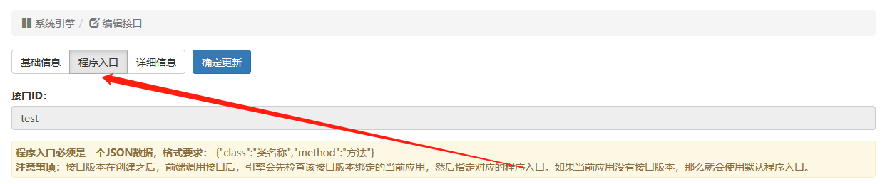
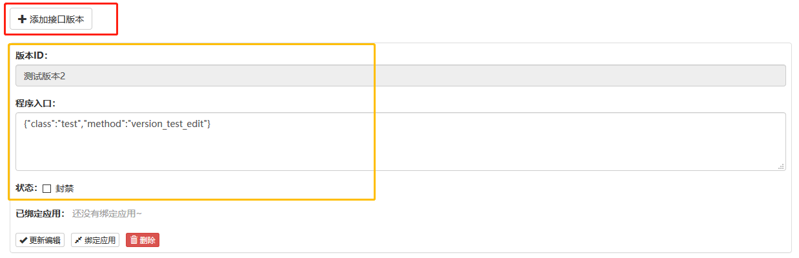
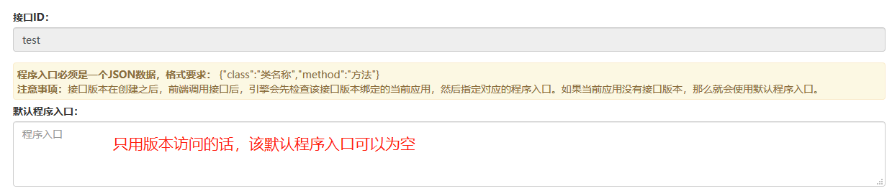
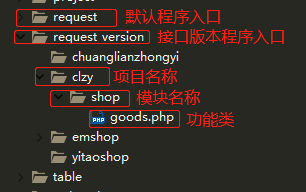
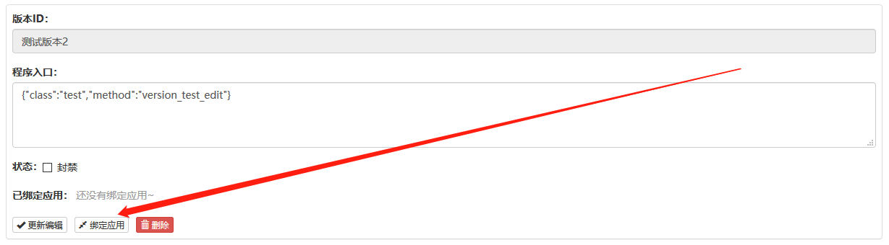

### 接口版本控制

在项目开发中，不同的项目存在不同的需求，这个时候就需要控制接口的版本。实现不同项目请求同一个接口ID，而程序入口不一样。如果把接口版本的权限给前端，如传一个版本号，那么会出现脏请求，所以这些工作都给了后端控制。后端只需要在添加接口的时候，添加版本ID，并给对应的版本ID添加程序入口。



如果有接口版本ID的程序入口，那么这个接口的默认程序入口是可以为空的。



### 接口版本的开发规范
接口版本ID可以是中文，最好是中文，因为好维护一点，而本身是不需要前端传值操作。
而程序入口的方法名称的命名需要注意，正常程序入口的方法都是以“api_”前缀开头，而版本程序入口，是以 “version_”来命名。注意，接口版本必须要写“重写版本”、“接口ID”、“版本ID”，如下：
```
//如果接口没有默认入口，那么重写版本就备注“无默认入口”
//该方法的程序入口，如{"class":"clzy/shop/goods","method":"version_self_add"}
/**
 * 重写版本：eapie\source\request\test::api_test()  
 * 接口ID：TEST
 * 版本ID: 测试版本
 * 
 * 测试
 * 
 * @param	array	$input
 */
public function version_self_add($input = array());
```
项目不同，需求也会不同，这个就需要接口版本来解决。接口版本的类文件是放在 `request_version` 目录下的。然后找到对应的项目文件夹，然后同样按照模块分类，如下：



注意父类继承，与默认接口一致，如下：
```
namespace eapie\source\request_version\clzy\shop;
use eapie\main;
use eapie\error;
class goods extends \eapie\source\request\shop {
    //注意，还是继承主模块类 \eapie\source\request\user    
}
```

### 给接口版本绑定应用



### 默认程序入口 与 接口版本的程序入口 的关系
默认程序入口是指，当 A应用 访问该接口，而该接口所有的接口版本ID都没有绑定 A应用 ，那么A应用执行的是默认程序入口。当默认程序入口为空，那么自然返回“接口异常”的错误信息。该操作可以控制接口的访问权限，比如该接口只允许 B应用 访问，那么里面接口版本ID只绑定B应用，并且默认程序入口为空，那么其他应用都无法访问该接口。

### 接口状态 与 接口版本的状态 的关系
接口版本中的状态如果为封禁，对应绑定的应用也就是禁止访问该接口了，即使该接口是开启状态也一样会禁止访问。如果接口


