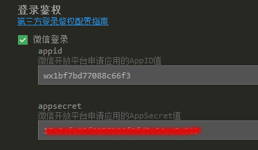

# openID 获取失败
- `weixin_login_openid`:获取到的openid。
- `weixin_login_code`:小程序支付获取的是code,需要先登录微信获取微信授权，再调用支付接口。
- 获取openid（openid获取失败）APP：微信返回的参数是infoRes.userInfo.openId，I大写。
- 获取openid（openid获取失败）微信小程序：检查微信小程序的appid 是不是正常。

# url回调地址不存在
需要在商户号中添加 公众号的域名 
并且添加接口地址（正式版和测试版都添加）

# 公众号中配置参数  
在公众号配置 接口地址和公众号域名

# appid和mch_id不匹配
找后端，微信开发平台负责人，是配置有问题。还有一种情况是在真机调试时，会报错商户号和openid不匹配，所以得打包后再测试。打包时：安卓包名需要和微信开放平台的包名一致。

# APP 支付 appid参数长度有误
后台配置有问题

# 登陆
在APP中使用微信支付，需要在APP SDK配置中 填写登录鉴权、支付。

# 微信支付接口返回“签名错误”的排查方法
- 1) 确认公众号的appSecret和商户号的API密钥没有搞混。
- 2) 重置商户API密钥。（本人亲测是这样解决了问题，tx真是个坑，我严重鄙视。）
- 3) 确认公众号授权的域名和目录是正确的。

# h5支付错误提示“当前页面的URL未注册”
在公众号支付时，页面弹出提示信息，说明在商户平台未设置 h5支付域名。

### 第一步 登录微信商户平台，点击我的产品 —— H5支付

### 第二步 添加H5支付域名

