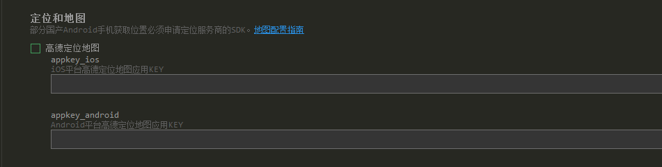

## 1）打包模块配置
###### 当APP中用到map等之类的APP模块权限，在`manifest.json`中添加权限：

###### 地图在APP中不能显示，必须要去第三方平台申请:

###### 打包时报错，Dcloud APPID非账号所有。
在点击`manifest.json`中——基础配置——应用标识，点击重新获取。

###### 打包时manifest.json中——基础配置——应用版本名称，对应的是后台中的版本号：

###### android包名一定要和开方平台上申请的包名一致：

## 2）打包到应用市场
版本问题，应用适配的Android版本     [https://ask.dcloud.net.cn/article/193]()

## 3）选择公用证书打包
应用签名：59201cf6589202cb2cdab26752472112