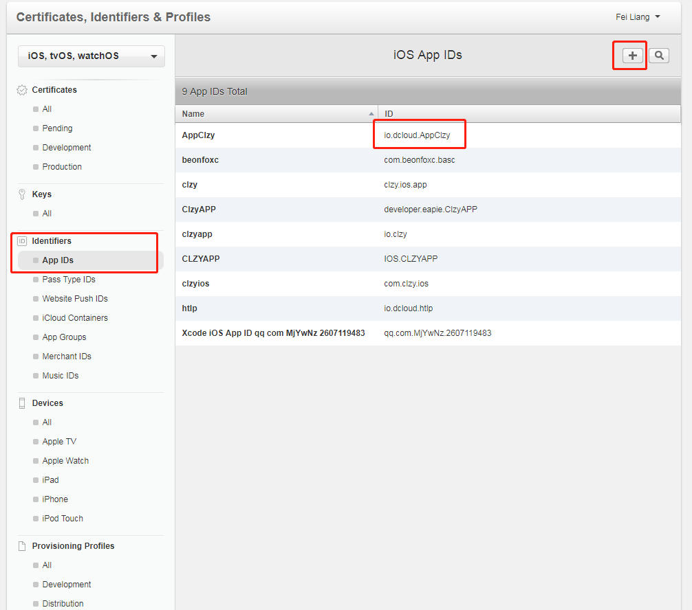
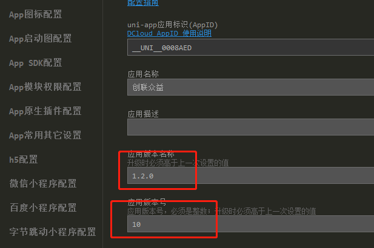
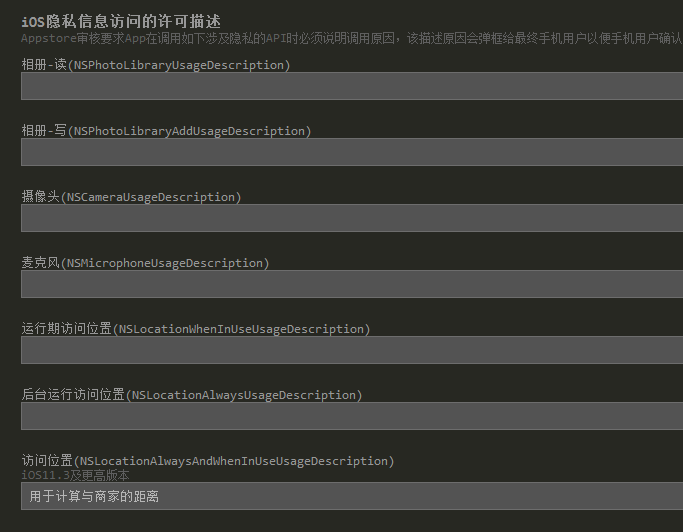

# 苹果上架

## 1）上架所需要的基本资料
##### 1.1）苹果开发者账号
首先要去申请一个套装ID，在开发人员的门户网站 `https://developer.apple.com/account/ios/certificate/` 首先找到套装ID，点击添加按钮，添加套装ID，列表中的ID就是套装ID，打包时的`Bundle ID`(AppID)

##### 1.2）做好的APP
打包好已经做好的APP

## 2）登录Appuploader申请证书文件和描述文件
##### 2.1）获取发布证书
打开Appuploader软件 ，有一个证书 &Profiles ，首先点击证书，点击右下角的add创建证书，选择类型发布证书，名称只要不是中文都可以，证书密码取好一定要记住，这个证书的密码就是打包时候填写的私钥密码。

##### 2.2）存储证书
勾选使用Appuploader服务存储证书。（这样就可以直接点击下载）

##### 2.3）下载p12文件
点击p12文件，下载。

##### 2.4）获取描述文件
先创建、然后点击描述文件下载即可。
- 应用id:选择对应的id（又称套装id，appid，BundleID，包名）
- 证书：选中全部就行
- Devices：设备这里不像选开发版profile时会出现，发布版不用选。
- 输入名称：不要中文，随意，123之类的就行，注意不要跟之前申请过的名称一样），点击ok创建。

# 正式版打包

#### 1）打包参数

- 1.选择IOS 使用苹果证书
- 2.Bundle ID ：套装ID
- 3.私钥密码：添加证书时的密码
- 4.Profile: 选择描述证书
- 5.私钥证书:p12证书

#### 2）上传IPA到苹果商店
打开Appuploader软件，找到IPA到苹果商店，点击单个IPA，然后选择打包好的APP。当显示 Success 就成功了。

#### 3）苹果应用商店

- 1.添加APP,套装ID就选择打包的时候使用的Bundle ID 。Sku :顺便写
- 2.填写APP的基础信息。
- 3.构建版本选择刚刚提交的IPA
- 4.提交审核。

#### 注意事项
苹果证书版打包时，必须得重新设置版本号名称和应用版本号：（如果之前没有构建版本可以不用重新设置）

检查代码中是否使用了摄像头，麦克风，手机功能的地方，如果有，写明调用原因。
